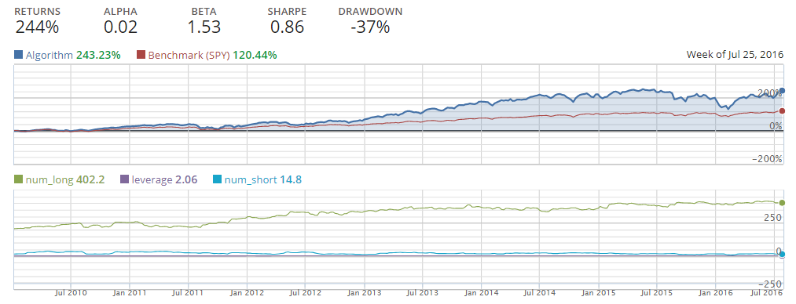
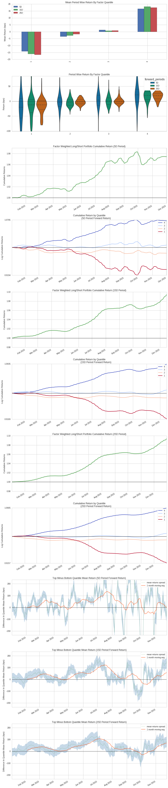

For hobby/educational purposes not meant for live testing, I have no plans to use to live nor do I recommend anyone ever using this live for that matter.
NOT High frequency trading, portfolio is rebalanced daily.
this is just for fun do not use.

Main idea is to target companies with high growth for purchase, currently looks at revenue growth, dps growth and a value score and boils those three into a number.  If an equity reaches the threshold it is bought, if it finds an equity that is rather not lacks growth it shorts it.  

Still lacks-

NEED BETTER WEIGHTS, dynamic weights would help a lot - working on it

Slippage 

Portfolio optimization 

Stop lost, can have some pretty wild sings going from +30 to 18% needs a stop loses and reevaluate

Currently only one strategy if an equity reaches the alpha threshold it is added to the portfolio and bought, and if certain equites are not growing at all they are shorted. 

Too much Leverage, some leverage is good yes but this later on behaves like a X2 leverage ETF more than anything else a stop lost function and portfolio optimization would help. 

Does not take into account other indictors i.e. SMA, RSI, etc. but that is fine for the most part can be included but this is not meant to be high frequency trading 

BackTest 2010 - 2016 * Algo does not work before 2010 due to lack of certain datasets 

Examples of Longs and Shorts

TearSheet for 2015 only

