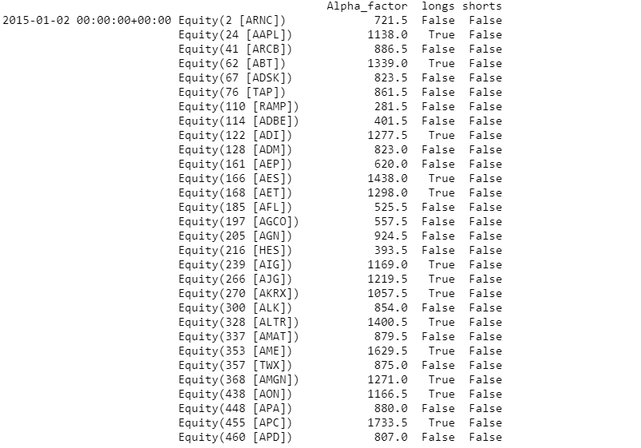

For hobby/educational purposes not meant for live testing, I have no plans to use to live nor do I recommend anyone ever using this live for that matter.
NOT High frequency trading, portfolio is rebalanced daily.

Main idea is to target companies with high growth for purchase, currently looks at revenue growth, dps growth.  If an equity reaches a certain threshold it is bought, if it finds certain equities that are underperforming it opens up short positions against those companies. 
TO DO

binomial distribution of weights

Slippage 

Portfolio optimization 

Stop los

Multiple strategies  

Take into account the bound market? 

Does not take into account other indictors i.e. SMA, RSI, etc. but that is fine for the most part can be included but this is not meant to be high frequency trading 

BackTest 2010 - 2016 * Algo does not work before 2010 due to lack of certain datasets 

Examples of Longs and Shorts

TearSheet for 2015 only

